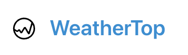

<p align="center">
  
</p>
<br/>

# **WeatherTop** 

Weather reporting App

<br/>

- [**WeatherTop**](#weathertop)
  - [Features](#features)
  - [Installation Instructions](#installation-instructions)
    - [Prerequisite tools to install](#prerequisite-tools-to-install)
    - [Build command](#build-command)
  - [Usage](#usage)
  - [Tools and Technology used](#tools-and-technology-used)
  - [How access it](#how-access-it)
  - [Directory structure](#directory-structure)
  - [Source Attributions](#source-attributions)
  - [Authors](#authors)

<br/>

## Features
- Dashboard page displaying the stations needed
- List of *country codes (ISO3166-1)* provided
- Weather icon change based on weather code
- Little description about the wheater under the weather icon
- *Latitude* and *longitud* from the stations displayed automatically once added
- Current weather displayed in the dashboard
- Temperature provided in two different units: *Celcius* and *Fahrenheit*
- Wind Direction provided in *degrees* and *coordinal direcction*
- *Temperature* (°C) bar chart
- *Humidity* (%) line chart
- *Auto-generate* report, where you can compare the reports token from previous days
- Map with a marker on the location of that station, with an option to zoom in or zoom out
- *User account* on menu, where you can edit your personal details, and also, delete your account if it is not longer need.

## Installation Instructions

### Prerequisite tools to install
- [node](https://nodejs.org)
- [VSCode](https://code.visualstudio.com/)
- [Git](https://git-scm.com/book/en/v2/Getting-Started-Installing-Git)
- [npm](https://docs.npmjs.com/cli/v10/commands/npm-install)

### Build command
To build this project run the following commands from the root directory of the repo:
``` console
# clone git repo
$ git clone https://github.com/MCLOPFER/WeatherTop_WebDevelopment_2.git
Cloning into 'WeatherTop_WebDevelopment_2'...
...

$ cd WeatherTop_WebDevelopment_2

# install required node packages
$ npm install
added 95 packages, and audited 96 packages in 498ms
...
```

## Usage
To run this project locally using npm, run the following command:
``` console
# start the project
$ npm start
> glitch-template@0.0.1 start
> node server.js

Todolist started on http://localhost:4000
```

The application will now be running on: http://localhost:4000/

To stop the project, enter Ctrl-C in the terminal.

## Tools and Technology used
- HTML
- Bulma CSS
- JavaScript
- JQuery
- Handelbars
- Glitch
- Node.js
- Dayjs
- Axios
- Leaflet
- Git

## How access it
You would just need internet and a device where you can open the following link: 
<br/>
https://gilded-holistic-bridge.glitch.me

## Directory structure
```
.
├── README.md
├── controllers
│   ├── about-controller.js
│   ├── accounts-controller.js
│   ├── dashboard-controller.js
│   ├── report-controller.js
│   ├── station-controller.js
│   └── user-controller.js
├── images
│   └── logo.png
├── models
│   ├── countryCodes.json
│   ├── object-store.js
│   ├── report-store.js
│   ├── reports.json
│   ├── station-store.js
│   ├── stations.json
│   ├── user-store.js
│   └── users.json
├── node_modules
├── package-lock.json
├── package.json
├── routes.js
├── server.js
├── utils
│   ├── store-utils.js
│   └── utils.js
└── views
    ├── about-view.hbs
    ├── countryCodeInfo-view.hbs
    ├── dashboard-view-error.hbs
    ├── dashboard-view.hbs
    ├── index.hbs
    ├── layouts
    │   └── main.hbs
    ├── login-view-error.hbs
    ├── login-view.hbs
    ├── partials
    │   ├── add-report.hbs
    │   ├── add-station-error.hbs
    │   ├── add-station.hbs
    │   ├── brand.hbs
    │   ├── cancel-delete-user.hbs
    │   ├── edit-report.hbs
    │   ├── icons
    │   │   ├── atmosphere.hbs
    │   │   ├── back.hbs
    │   │   ├── cloudy.hbs
    │   │   ├── delete.hbs
    │   │   ├── drizzle.hbs
    │   │   ├── edit.hbs
    │   │   ├── error.hbs
    │   │   ├── info.hbs
    │   │   ├── location.hbs
    │   │   ├── logo.hbs
    │   │   ├── pressure.hbs
    │   │   ├── rain.hbs
    │   │   ├── snow.hbs
    │   │   ├── success.hbs
    │   │   ├── sun.hbs
    │   │   ├── temperature.hbs
    │   │   ├── thunderstorm.hbs
    │   │   ├── user.hbs
    │   │   └── wind.hbs
    │   ├── list-reports.hbs
    │   ├── list-stations.hbs
    │   ├── menu.hbs
    │   ├── navbar-burger.hbs
    │   ├── station-summary.hbs
    │   ├── user-account.hbs
    │   ├── user-update.hbs
    │   └── welcome-menu.hbs
    ├── report-view.hbs
    ├── signup-view-error.hbs
    ├── signup-view.hbs
    ├── station-view.hbs
    ├── user-view-error.hbs
    ├── user-view-updated-successfully.hbs
    └── user-view.hbs
```
## Source Attributions
- Icons: https://iconify.design/
- Weather code references: API from https://openweathermap.org/api
- Map reference: https://leafletjs.com/examples/quick-start/

## Authors
- Mari Cruz Lopez: 20108907@gmail.wit.ie
- Student Number: 20108907


